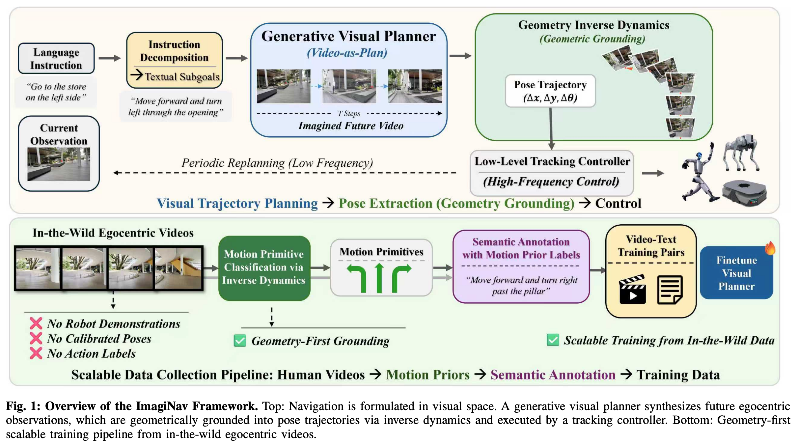

# ImagiNav: Scalable Embodied Navigation via Generative Visual Prediction and Inverse Dynamics

<p align="center">
  <a href="https://j1dan.github.io/ImagiNav/">
    
  </a>
  <a href="https://arxiv.org/abs/2603.13833">
    
  </a>
</p>

<p align="center">
  
</p>

ImagiNav is a research codebase for vision-language navigation with imagined
egocentric video. It combines a Gemini-based reasoner, LTX-Video generation,
and VGGT motion estimation to propose and evaluate short-horizon navigation
actions.

This repository contains the ImagiNav pipeline, training configurations,
checkpoint and dataset instructions, and offline video-quality evaluation.
Use the [ManualInternNav integration](https://github.com/J1dan/ManualInternNav-release)
for simulator evaluation.

## Contents

- [Repository layout](#repository-layout)
- [Requirements](#requirements)
- [Installation](#installation)
- [Download checkpoints](#download-checkpoints)
- [Quick generation example](#quick-generation-example)
- [Training](#training)
- [Evaluation](#evaluation)
- [Reported video-quality results](#reported-video-quality-results)
- [Configuration](#configuration)
- [Known limitations](#known-limitations)
- [License](#license)
- [Citation](#citation)

## Repository layout

| Path | Purpose |
| --- | --- |
| `core/` | Pipeline orchestration, configuration, and shared types |
| `models/` | Gemini reasoning, LTX-Video imagination, VGGT navigation, and controllers |
| `interfaces/` | Adapter for the external InternNav simulator |
| `configs/` | Default ImagiNav runtime configuration |
| `video_quality_eval/` | Offline generation and quality metrics |
| `LTX-Video-Trainer/` | Pinned training and inference submodule |
| `vggt/` | Pinned VGGT fork and ImagiNav motion-processing scripts |
| `examples/` | Small command-line examples |

## Requirements

The main generation and evaluation workflows expect:

- Linux
- Python 3.10
- an NVIDIA GPU with a working CUDA installation
- Git and Git LFS
- [`uv`](https://docs.astral.sh/uv/)
- `ffmpeg` for extracting frames and writing broadly compatible videos
- a Google API key for Gemini-backed reasoning or scoring

The checkpoints and datasets are large. At the time of release, the checkpoint
repository is approximately 10 GB and the complete dataset is approximately
31 GB. Download only the artifacts required for your workflow.

## Installation

For generation, training, and offline evaluation, clone ImagiNav directly:

```bash
git clone https://github.com/J1dan/ImagiNav-release.git ImagiNav
git -C ImagiNav submodule update --init --recursive LTX-Video-Trainer vggt

export IMAGINAV_ROOT="$PWD/ImagiNav"
export PYTHONPATH="$PWD${PYTHONPATH:+:$PYTHONPATH}"
```

For simulator evaluation, clone ManualInternNav with its pinned ImagiNav
submodule:

```bash
git clone https://github.com/J1dan/ManualInternNav-release.git
cd ManualInternNav-release
git submodule update --init ImagiNav
git -C ImagiNav submodule update --init --recursive LTX-Video-Trainer vggt
export IMAGINAV_ROOT="$PWD/ImagiNav"
export PYTHONPATH="$PWD${PYTHONPATH:+:$PYTHONPATH}"
```

The commands below assume `IMAGINAV_ROOT` points to the clone and `PYTHONPATH`
contains its parent directory. This is required because the Python package is
the repository directory itself.

Install `uv` if it is unavailable:

```bash
curl -LsSf https://astral.sh/uv/install.sh | sh
```

Create the environment from the pinned LTX-Video trainer:

```bash
cd "$IMAGINAV_ROOT/LTX-Video-Trainer"
uv sync --frozen --python 3.10

uv pip install --python .venv/bin/python -r "$IMAGINAV_ROOT/requirements.txt"
uv pip install --python .venv/bin/python --no-deps \
    -e "$IMAGINAV_ROOT/vggt" \
    -e "$IMAGINAV_ROOT/video_quality_eval/content-debiased-fvd"

export IMAGINAV_PYTHON="$IMAGINAV_ROOT/LTX-Video-Trainer/.venv/bin/python"
export IMAGINAV_HF="$IMAGINAV_ROOT/LTX-Video-Trainer/.venv/bin/huggingface-cli"
```

The pinned trainer environment supplies `huggingface-cli`. Run
`"$IMAGINAV_HF" login` first if a model or dataset requires authentication.

On Blackwell GPUs, the PyTorch build in the lockfile may not support `sm_120`.
If needed, upgrade PyTorch and bitsandbytes after the base environment is
installed:

```bash
uv pip install --python .venv/bin/python --upgrade --pre torch torchvision \
    --index-url https://download.pytorch.org/whl/nightly/cu130
uv pip install --python .venv/bin/python --upgrade bitsandbytes \
    --index-url https://pypi.org/simple
```

Verify the environment from the directory containing the clone:

```bash
cd "$IMAGINAV_ROOT/.."
"$IMAGINAV_PYTHON" -c \
  "import cv2, torch, google.genai, vggt, cdfvd; print('torch', torch.__version__, 'cuda', torch.cuda.is_available())"
```

## Download checkpoints

Download the model variant needed for your experiment. The default AC-MoE
runtime requires both left and right adapters:

```bash
mkdir -p "$IMAGINAV_ROOT/checkpoints"

"$IMAGINAV_HF" download J1dan/imaginav \
  --include "LTX-2B-AC-MoE-LoRA/*" \
  --local-dir "$IMAGINAV_ROOT/checkpoints"

"$IMAGINAV_HF" download J1dan/imaginav \
  LTX-13B-LoRA/lora-weights-13b-85epoch.safetensors \
  --local-dir "$IMAGINAV_ROOT/checkpoints"

"$IMAGINAV_HF" download J1dan/imaginav \
  LTX-2B-Full/model-weights-85epoch.safetensors \
  --local-dir "$IMAGINAV_ROOT/checkpoints"
```

The default configuration expects the AC-MoE adapters at:

```text
ImagiNav/checkpoints/LTX-2B-AC-MoE-LoRA/lora-weights-2b-85epoch-left.safetensors
ImagiNav/checkpoints/LTX-2B-AC-MoE-LoRA/lora-weights-2b-85epoch-right.safetensors
```

## Quick generation example

Prepare a PNG reference frame, then run:

```bash
cd "$IMAGINAV_ROOT/.."

"$IMAGINAV_PYTHON" -m ImagiNav.examples.generate_video \
  --image /path/to/reference.png \
  --prompt "POV, pan left and dolly forward" \
  --expert left
```

By default, the generated video is written under `ImagiNav/outputs/demo/`.
Use `--help` to see device, seed, configuration, and output options.

## Training

### Use the released dataset

The released training data contains processed clips and precomputed LTX
features. Download the real and simulation subsets into the trainer directory:

```bash
mkdir -p "$IMAGINAV_ROOT/LTX-Video-Trainer/datasets"
"$IMAGINAV_HF" download J1dan/imaginav-dataset \
  --repo-type dataset \
  --include "real-clips-121/**" "simulation-clips-121/**" \
  --local-dir "$IMAGINAV_ROOT/LTX-Video-Trainer/datasets"
```

### Prepare a custom dataset

Extract 121-frame motion clips with VGGT:

```bash
cd "$IMAGINAV_ROOT"

"$IMAGINAV_PYTHON" vggt/imaginav_scripts/extract_motion_clips.py \
  --input_folders /path/to/raw_videos \
  --output_folder /path/to/extracted_outputs \
  --window_len 121 \
  --stride 24 \
  --analysis_subsample_step 6 \
  --gpus 0
```

For simulation videos, use
`vggt/imaginav_scripts/extract_motion_clips_simulation.py` and the simulation
subsampling setting `--analysis_subsample_step 2`.

Label the clips with Gemini:

```bash
export GOOGLE_API_KEY=YOUR_GOOGLE_API_KEY

"$IMAGINAV_PYTHON" vggt/imaginav_scripts/label_clips.py \
  --input_folder /path/to/extracted_outputs \
  --metadata /path/to/extracted_outputs/sum_metadata.json \
  --output /path/to/extracted_outputs/dataset.json
```

Precompute LTX training features:

```bash
cd "$IMAGINAV_ROOT/LTX-Video-Trainer"

"$IMAGINAV_PYTHON" scripts/preprocess_dataset.py /path/to/extracted_outputs/dataset.json \
  --resolution-buckets "480x256x121" \
  --caption-column caption \
  --video-column media_path \
  --model-source LTXV_2B_0.9.6_DEV \
  --id-token "POV," \
  --device cuda:0
```

### Run training

The trainer submodule includes four ImagiNav configurations:

- `configs/ltxv_2b_lora-imaginav-left.yaml`
- `configs/ltxv_2b_lora-imaginav-right.yaml`
- `configs/ltxv_2b_full-imaginav.yaml`
- `configs/ltxv_13b_lora-imaginav.yaml`

For example:

```bash
cd "$IMAGINAV_ROOT/LTX-Video-Trainer"
"$IMAGINAV_PYTHON" scripts/train.py configs/ltxv_2b_lora-imaginav-left.yaml
```

Review dataset paths, output paths, GPU settings, and batch size in the selected
configuration before starting a long training run.

## Evaluation

### Offline video quality

The offline pipeline computes motion fidelity, RPE, LPIPS, PSNR, SSIM, and FVD.
Download the evaluation subset and expose it at the path used by the default
configuration:

```bash
mkdir -p "$IMAGINAV_ROOT/video_quality_eval/datasets"
"$IMAGINAV_HF" download J1dan/imaginav-dataset \
  --repo-type dataset \
  --include "eval_clips/**" \
  --local-dir "$IMAGINAV_ROOT/video_quality_eval/datasets"
ln -sfn eval_clips \
  "$IMAGINAV_ROOT/video_quality_eval/datasets/reference_videos"
```

The source manifest should now be at
`$IMAGINAV_ROOT/video_quality_eval/datasets/reference_videos/dataset-20260131.json`.
Download the AC-MoE adapters above before generation. From the directory
containing the clone, extract first frames, generate videos, then compute
metrics:

```bash
cd "$IMAGINAV_ROOT/.."
CONFIG=ImagiNav/video_quality_eval/configs/video_quality_eval.yaml

"$IMAGINAV_PYTHON" -m ImagiNav.video_quality_eval.scripts.extract_first_frames \
  --config "$CONFIG"
"$IMAGINAV_PYTHON" -m ImagiNav.video_quality_eval.eval_video_gen \
  --config "$CONFIG"
"$IMAGINAV_PYTHON" -m ImagiNav.video_quality_eval.evaluator \
  --config "$CONFIG" \
  --dataset ImagiNav/video_quality_eval/datasets/reference_videos/dataset-20260131_with_firstframes_full.json \
  --out ImagiNav/video_quality_eval/results/full
```

The evaluator writes per-sample results to `results.json` and aggregate
metrics to `aggregate_metrics.json` in the output directory. The default
configuration disables Gemini scoring; set `enable_metrics.gemini_scoring`
only if you also provide a Google API key. FVD downloads its VideoMAE
checkpoint automatically unless `fvd.ckpt_path` is set.

### InternNav simulation

Use the ManualInternNav checkout above for simulator evaluation. Its launcher is
`scripts/eval/bash/start_imaginav_eval.sh`, and
`interfaces/internnav_bridge.py` maps ImagiNav predictions to InternNav
actions. Pull the [InternNav v1.2 container](https://hub.docker.com/r/xerneaschen/internnav/tags)
and set the checkpoint paths in `ImagiNav/configs/default_config.yaml`:

```bash
docker pull xerneaschen/internnav@sha256:3694591f95b5050a631a672e7e718a388f89d027b565f4aac3e3204abf528ada
```

The simulation datasets are [InteriorAgent](https://huggingface.co/datasets/spatialverse/InteriorAgent),
[InteriorAgent_Nav](https://huggingface.co/datasets/spatialverse/InteriorAgent_Nav),
and [Embodiments](https://huggingface.co/datasets/InternRobotics/Embodiments).

## Reported video-quality results

The following results were measured on the full released evaluation set:

| Model | FVD ↓ | LPIPS ↓ | PSNR ↑ | SSIM ↑ | Motion fidelity ↑ | RPE-T (m) ↓ | RPE-R (deg) ↓ |
| --- | ---: | ---: | ---: | ---: | ---: | ---: | ---: |
| Base LTX-2B (zero-shot) | 391.14 | 0.520 | 12.61 | 0.37 | 0.40 | 0.036 | 1.39 |
| Real-finetuned 2B without AC-MoE | 73.08 | 0.486 | 13.36 | 0.40 | 0.60 | 0.028 | 1.31 |
| Sim-finetuned 2B | 72.72 | 0.514 | 13.03 | 0.39 | 0.67 | 0.051 | 1.73 |
| Real-finetuned 2B AC-MoE | 65.39 | 0.481 | 13.27 | 0.40 | 0.72 | 0.024 | 1.18 |
| Unified 2B full fine-tune | 56.15 | 0.475 | 13.33 | 0.40 | 0.72 | 0.027 | 1.29 |
| Unified 13B LoRA | 58.88 | 0.474 | 13.70 | 0.41 | 0.75 | 0.021 | 1.31 |

## Configuration

Copy `configs/default_config.yaml` before changing experiment settings. The
main sections are:

- `reasoner`: Gemini model, API-key environment variable, and prompts
- `imagination`: LTX model, adapter paths, video dimensions, and sampling
- `navigation`: VGGT checkpoint and controller parameters
- `logging`: output location and retained artifacts

Never commit API keys, downloaded checkpoints, datasets, generated videos, or
local machine paths. The default `.gitignore` excludes the common locations.

## Known limitations

1. **Embodiment specificity and obstacle avoidance.** Generated videos are
   strongly influenced by the embodiment and environments represented in the
   training data. The current pipeline also lacks fine-grained
   obstacle-avoidance mechanisms. For safer execution, ImagiNav should be
   combined with a local planner or reactive collision-avoidance controller.

2. **Metric-scale ambiguity.** The current controller gains are tuned
   empirically and may not transfer reliably across embodiments or
   environments. Future implementations could recover metric scale using
   additional geometric or sensory information, such as calibrated camera
   parameters together with a known camera height, wheel odometry, or stereo
   or depth measurements.

3. **Use of generated visual plans.** Generated videos currently serve as
   high-level visual plans and are not necessarily consumed or interpreted
   directly by the inverse-dynamics model. Future work could make fuller use
   of the generated visual content by integrating video-conditioned or
   image-conditioned navigation policies such as
   [NoMaD](https://github.com/robodhruv/visualnav-transformer) or
   [NavDP](https://github.com/InternRobotics/NavDP).

## License

ImagiNav is released under the [MIT License](LICENSE). Submodules and vendored
third-party components retain their own licenses; review those terms before
redistribution.

## Citation

If this repository is useful in your research, please cite:

```bibtex
@inproceedings{chen2026,
  author    = {Chen, Jie and Cai, Yuxin and Wang, Yizhuo and Bai, Ruofei and Cao, Yuhong and li, jun and Yau, Wei-Yun and Sartoretti, Guillaume Adrien},
  title     = {{ImagiNav: Scalable Embodied Navigation Via Generative Visual Prediction and Inverse Dynamics}},
  booktitle = {2026 IEEE/RSJ International Conference on Intelligent Robots and Systems (IROS)},
  year      = {2026},
}
```
